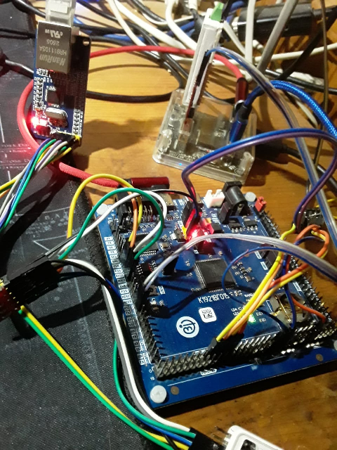
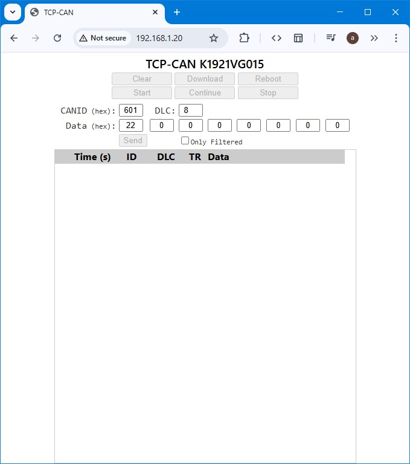

# CANopenNode-VG015
CanOpenNode port for K1921VG015

It is based on [CANopenNode](https://github.com/CANopenNode/CANopenNode), which is free and open source CANopen Stack and is included as a git submodule.

Development board with W5500 module (SPI)

Web server on K1921VG015 for CANOpenNode log.
